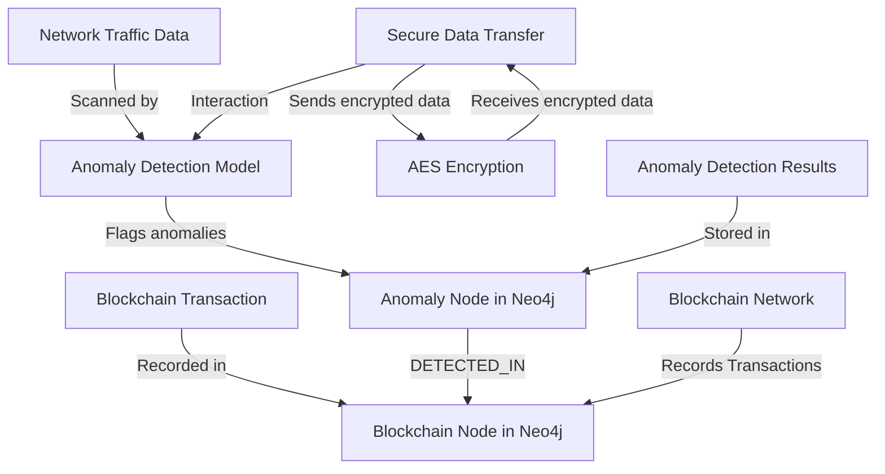

# Chagu 
# ChainGuard


# Nodes:

## Network Traffic Data: Represents the source of data that is analyzed by the anomaly detection model.
## Anomaly Detection Model: Scans network traffic data to flag anomalies.
## Anomaly Node in Neo4j: Represents flagged anomalies stored as nodes in the Neo4j database.
## Blockchain Transaction: Represents a transaction recorded in the blockchain.
## Blockchain Node in Neo4j: Represents a blockchain transaction stored as a node in Neo4j.
## Secure Data Transfer: Represents the secure transfer of data between nodes.
## AES Encryption: The method used to encrypt and decrypt the data during transfer.
## Blockchain Network: The network where transactions are recorded.
## Anomaly Detection Results: Results of anomaly detection stored in Neo4j.

# Relationships:

## Scanned by: Indicates the process of scanning network traffic data by the anomaly detection model.
## Flags anomalies: Shows that the model flags anomalies and creates corresponding nodes in Neo4j.
## DETECTED_IN: Relationship between an anomaly and a blockchain transaction where the anomaly was detected.
## Sends encrypted data: Indicates the data transfer process using AES encryption.
## Receives encrypted data: Represents the reception of encrypted data.
## Records Transactions: Indicates that the blockchain network records transactions in the blockchain.
## Stored in: Represents the storage of anomaly detection results in the Neo4j graph database.
## Interaction: Shows the interaction between secure data transfer and the anomaly detection model.
## ChainGuard is a custom protocol designed for secure data transformation using blockchain technology. It leverages AES encryption for confidentiality and plans to integrate blockchain for data integrity and traceability.

https://pypi.org/project/chagu/
```commandline
    pip install chainguard
```
## Features
- AES Encryption and Decryption
- (Planned) Blockchain Integration
- Unit and Integration Tests

## Installation

```bash
pip install -r requirements.txt
```
usage
``` code
    from chainguard.encryption import AESCipher
    
    password = "yourpassword"
    cipher = AESCipher(password)
    
    # Encrypt and Decrypt
    plaintext = "Hello, World!"
    encrypted = cipher.encrypt(plaintext)
    decrypted = cipher.decrypt(encrypted)
    
    print(f"Encrypted: {encrypted}")
    print(f"Decrypted: {decrypted}")

```
## Data Transfer Protocol

ChainGuard now includes a secure data transfer protocol to securely send and receive data between nodes.

### Example Usage

```python
from chainguard.data_transfer import SecureDataTransfer

# Initialize SecureDataTransfer with a shared password
transfer = SecureDataTransfer(password="securepassword")

# On the sending side
transfer.send_data("This is a secure message")

# On the receiving side
transfer.receive_data()
```


## Blockchain Integration

ChainGuard includes a custom blockchain to securely log and verify each data transfer. This ensures transparency, immutability, and traceability of all transactions.

### Example Usage

```python
from chainguard.data_transfer import SecureDataTransfer

# Initialize SecureDataTransfer with a shared password
transfer = SecureDataTransfer(password="securepassword")

# On the sending side
transfer.send_data("This is a secure message")

# On the receiving side
transfer.receive_data()

# Validate blockchain
is_valid = transfer.validate_blockchain()
print(f"Blockchain valid: {is_valid}")
```
# Anomaly Detection Model , based on shodan scanner
## Overview
This repository contains a Python class AnomalyDetectionModel built using TensorFlow and Keras
for detecting anomalies in network traffic data. The class encapsulates the creation, training,
and evaluation of a neural network model designed to classify network data as either normal or anomalous.

### Why Use a Sequential Model?
The Sequential model in Keras is a simple, linear stack of layers. 
It is ideal for building feedforward neural networks where the model 
progresses through each layer sequentially, without any branching or complex topologies.

### Key Reasons for Using Sequential:

Simplicity: The Sequential API is straightforward and easy to use. It is perfect for beginners and 
for models that involve a single input and output with layers stacked one after the other.

Linear Stack: For the task of anomaly detection, the architecture typically involves a simple
forward pass through several dense layers, making the Sequential model a natural fit.

Flexibility: While simple, the Sequential model is flexible enough to allow for customization
through the addition of various types of layers, activation functions, and regularization techniques.

Example Usage
```bash
# Initialize the model with the input shape
anomaly_model = AnomalyDetectionModel(X_train.shape[1])
# Train the model
history = anomaly_model.train(X_train, y_train)
# Evaluate the model on the test data
loss, accuracy = anomaly_model.evaluate(X_test, y_test)
print(f'Test Accuracy: {accuracy:.4f}')
```

Dependencies
Python 3.x
TensorFlow
Keras (included with TensorFlow)
Scikit-learn
Pandas
Installation
Install the required packages using pip:

Conclusion
The Sequential model is a great choice for this anomaly detection task due to its simplicity,
ease of use, and the linear nature of the problem. This approach ensures that the model is easy
to build, understand, and maintain while still providing robust performance for binary classification
tasks such as anomaly detection.